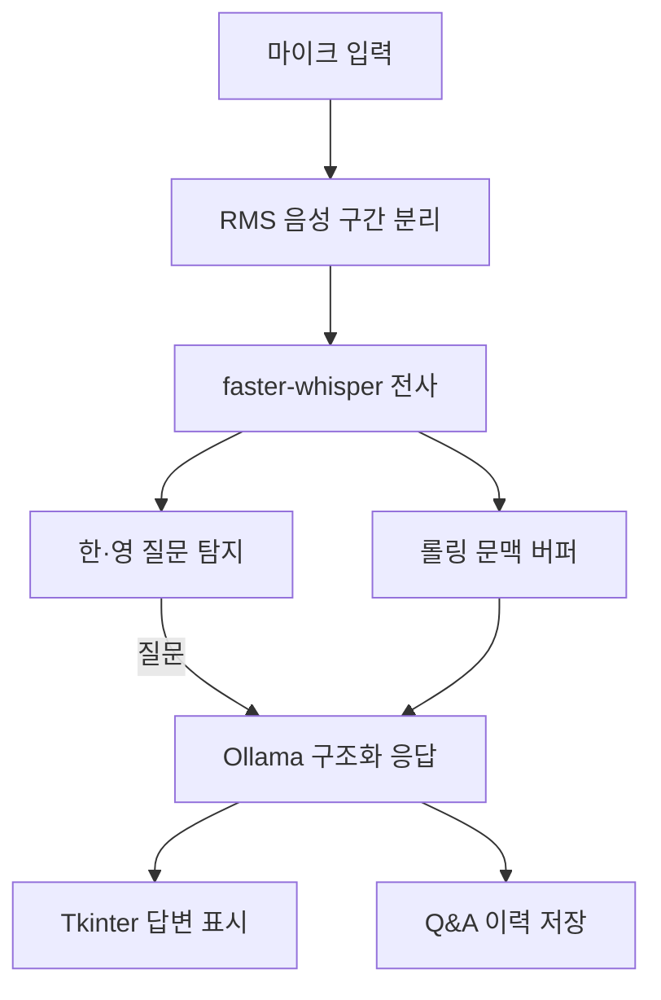

# 시스템 구조

## 처리 흐름

## 설계 원칙

1. 질문 탐지, 설정, 이력, LLM 응답 파싱을 `quizsense` 패키지로 분리해 장치 없이 테스트한다.
2. 마이크·Whisper·Tkinter 연동은 실행 계층에 둔다.
3. 탐지 결과에 점수와 근거를 남겨 오탐·미탐 분석이 가능하게 한다.
4. 평가 입력과 결과를 함께 버전 관리해 결과를 재현할 수 있게 한다.
5. 구현된 기능과 미검증 기능을 문서에서 구분한다.

## 모듈 책임

| 모듈 | 책임 |
|---|---|
| `config.py` | 실행 설정, 환경변수 로드, 유효성 검사 |
| `question_detection.py` | 질문 분류·추출, 쿨다운, 유사 질문 중복 억제 |
| `llm.py` | Ollama 연결, JSON 형식 강제, 응답 필드 검증 |
| `history.py` | Q&A·오류·지연시간 요약 및 CSV/JSON 저장 |
| `evaluation.py` | 혼동행렬·정확도·정밀도·재현율·F1 계산 |
| `quizzesense_ai.py` | 오디오, STT, UI, 전체 실행 흐름 |

## 평가 경계

현재 자동 평가는 질문 탐지 코어와 설정·이력·응답 파싱을 다룹니다. 마이크 장치, Whisper 모델, Ollama 실행은 환경 의존성이 있어 CI 범위에서 제외하며, 종단 성능은 동일 장치에서 별도 실험해야 합니다.
